# ER-модель базы данных

Диаграмма отражает текущие PostgreSQL-таблицы по всем сервисным БД проекта. Физические `FOREIGN KEY` есть только внутри отдельных service DB. Связи между разными БД показаны как логические: сервисы синхронизируют состояние через Kafka events и общий идентификатор заказа `order_id`.

```mermaid
erDiagram
    ORDERS {
        uuid id PK
        text customer_id
        text status
        bigint total_amount
        text delivery_address
        text payment_scenario
        timestamptz created_at
        timestamptz updated_at
    }
    ORDER_ITEMS {
        uuid id PK
        uuid order_id FK
        text sku
        int quantity
        bigint price
    }

    STATUS_HISTORY {
        uuid id PK
        uuid order_id FK
        text old_status
        text new_status
        text reason
        timestamptz created_at
    }

    OUTBOX_EVENTS {
        uuid id PK
        text event_type
        text topic
        uuid aggregate_id
        jsonb payload
        text status
        timestamptz created_at
        timestamptz published_at
    }

    ORDER_PROCESSED_EVENTS {
        uuid event_id PK
        text event_type
        timestamptz processed_at
    }

    STOCK_ITEMS {
        text sku PK
        int available_quantity
        int reserved_quantity
        timestamptz updated_at
    }

    STOCK_RESERVATIONS {
        uuid id PK
        uuid order_id UK
        text status
        timestamptz created_at
        timestamptz updated_at
    }

    STOCK_RESERVATION_ITEMS {
        uuid id PK
        uuid reservation_id FK
        text sku FK
        int quantity
    }

    INVENTORY_PROCESSED_EVENTS {
        uuid event_id PK
        text event_type
        timestamptz processed_at
    }

    PAYMENTS {
        uuid id PK
        uuid order_id UK
        bigint amount
        text status
        text reason
        timestamptz created_at
        timestamptz updated_at
    }

    PAYMENT_PROCESSED_EVENTS {
        uuid event_id PK
        text event_type
        timestamptz processed_at
    }

    DELIVERIES {
        uuid id PK
        uuid order_id UK
        text status
        text delivery_address
        text tracking_number
        text reason
        timestamptz created_at
        timestamptz updated_at
    }

    DELIVERY_PROCESSED_EVENTS {
        uuid event_id PK
        text event_type
        timestamptz processed_at
    }

    NOTIFICATION_TASKS {
        uuid id PK
        uuid order_id
        uuid event_id UK
        text status
        jsonb payload
        timestamptz created_at
        timestamptz updated_at
    }

    SENDING_LOG {
        uuid id PK
        uuid notification_task_id FK
        text status
        text message
        timestamptz created_at
    }

    NOTIFICATION_PROCESSED_EVENTS {
        uuid event_id PK
        text event_type
        timestamptz processed_at
    }

    ORDER_VIEW {
        uuid order_id PK
        text customer_id
        text order_status
        text payment_status
        text delivery_status
        bigint total_amount
        timestamptz created_at
        timestamptz updated_at
    }

    ORDER_EVENT_HISTORY {
        uuid event_id PK
        uuid order_id
        text event_type
        text service_name
        timestamptz occurred_at
        jsonb payload
    }

    READMODEL_PROCESSED_EVENTS {
        uuid event_id PK
        text event_type
        timestamptz processed_at
    }

    ORDERS ||--o{ ORDER_ITEMS : contains
    ORDERS ||--o{ STATUS_HISTORY : has
    ORDERS ||--o{ OUTBOX_EVENTS : publishes

    STOCK_RESERVATIONS ||--o{ STOCK_RESERVATION_ITEMS : contains
    STOCK_ITEMS ||--o{ STOCK_RESERVATION_ITEMS : reserved_as

    NOTIFICATION_TASKS ||--o{ SENDING_LOG : writes

    ORDERS ||..o| STOCK_RESERVATIONS : order_id
    ORDERS ||..o| PAYMENTS : order_id
    ORDERS ||..o| DELIVERIES : order_id
    ORDERS ||..o{ NOTIFICATION_TASKS : order_id
    ORDERS ||..o| ORDER_VIEW : projected_as
    ORDERS ||..o{ ORDER_EVENT_HISTORY : events
```

## Границы сервисных БД

| БД | Таблицы |
| --- | --- |
| `order_db` | `orders`, `order_items`, `status_history`, `outbox_events`, `processed_events` |
| `inventory_db` | `stock_items`, `stock_reservations`, `stock_reservation_items`, `processed_events` |
| `payment_db` | `payments`, `processed_events` |
| `delivery_db` | `deliveries`, `processed_events` |
| `notification_db` | `notification_tasks`, `sending_log`, `processed_events` |
| `read_db` | `order_view`, `order_event_history`, `processed_events` |

## Примечания

- `processed_events` используется каждым consumer-сервисом для идемпотентной обработки Kafka-событий.
- `outbox_events` относится к Transactional Outbox в `order-service`.
- `order_view` и `order_event_history` являются read model, построенной из Kafka events.
- `payments.order_id`, `deliveries.order_id`, `stock_reservations.order_id` и `notification_tasks.order_id` уникальны/логически связаны с `orders.id`, но находятся в отдельных БД и не имеют физического FK на `order_db.orders`.
